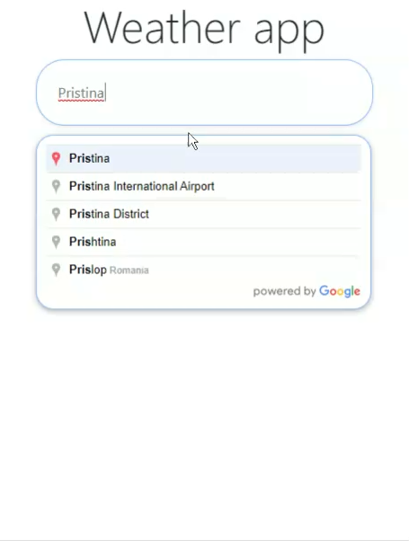
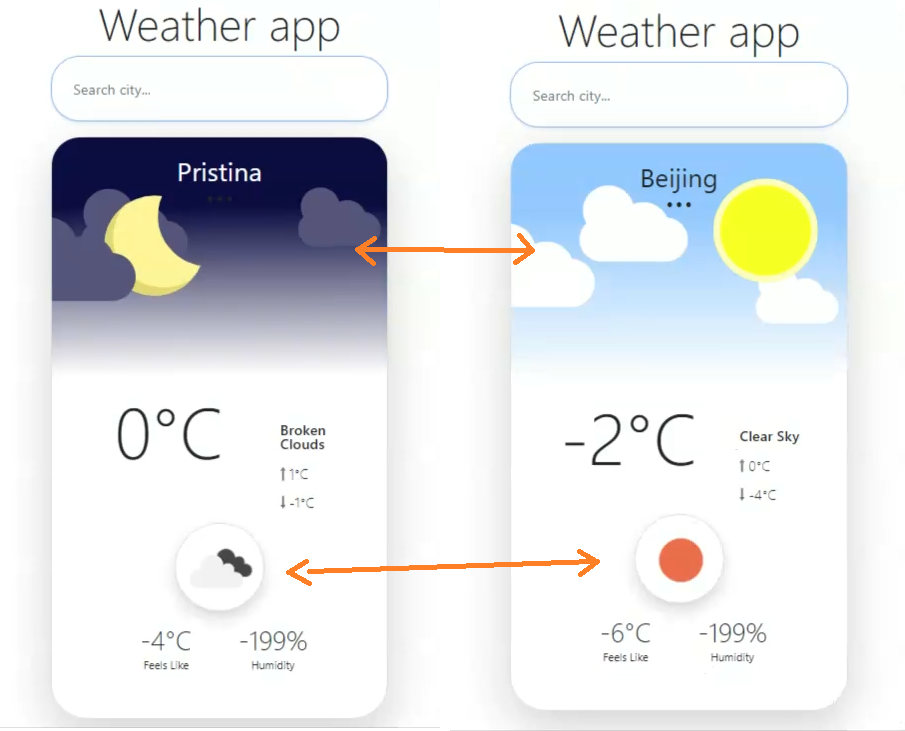

# Weather_app
 
<a href="happy-benz-4a4a6e.netlify.app">DEMO 
 
<h6>-- Latest update -- 
 -- When the app is first opened it asks for users location and then display weather based in users location --  
  
Weather app that consumes data by an external api(https://openweathermap.org). It has some great features ex. 
search autocomplete that uses Places api from google, also it has included sweetalerts2 when searches are not found, it changes images and icons based in (day, night, sun, clouds, rain etc...)  
 
#Sweetalert2 - If the searched city is not found  
  

 
#Places api - Autocomplete  
 

#Openweathermap api - This image is showing the preview of consumed data from api and conditional displaying image and icon also text weather its daytime or night-time  
 

