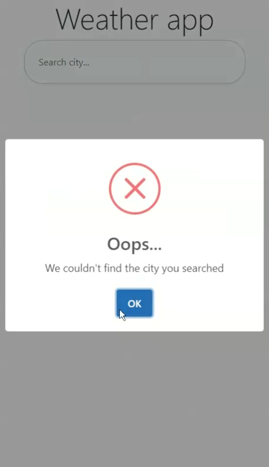

# Weather_app

  <h2>-- Latest update -- / *When the app is first opened it asks for users location and then display weather based in users location* 
Weather app that consumes data by an external api(https://openweathermap.org). It has some great features ex. 
search autocomplete that uses Places api from google, also it has included sweetalerts2 when searches are not found.

#Sweetalert2 - If the searched city is not found  

#Places api - Autocomplete  

#Openweathermap api - This image is showing the preview of consumed data from api and conditional displaying image and icon also text weather its daytime or night-time  

